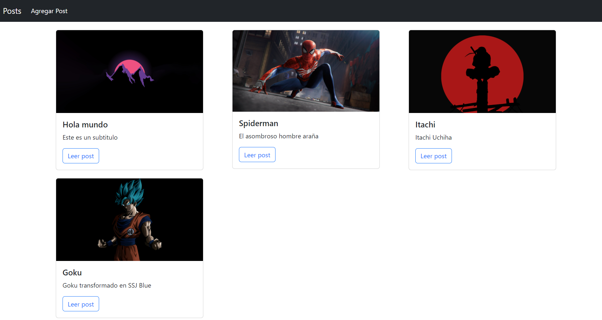
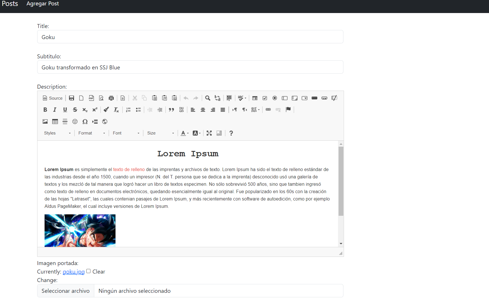

# Blog con Django

Blog sencillo hecho con Django y Bootstrap para los estilos

## Uso
- Clonar el repositorio
    ```bash
    git clone https://github.com/brianrscode/blog-django.git
    ```
- Instalar los requerimientos
    ```bash
    pip install -r requirements.txt
    ```

## Ejemplos
<table>
    <tr>
        <td>
            
        </td>
    </tr>
    <tr>
        <td>
            
        </td>
    </tr>
</table>
